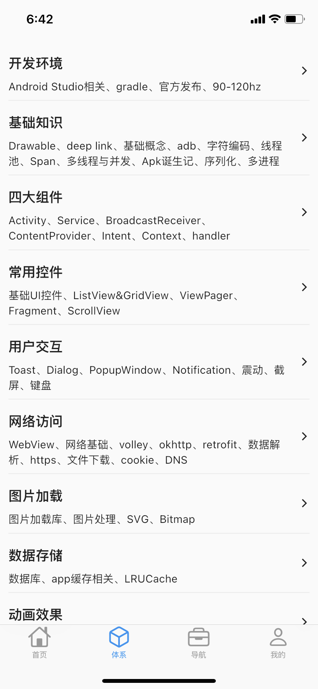
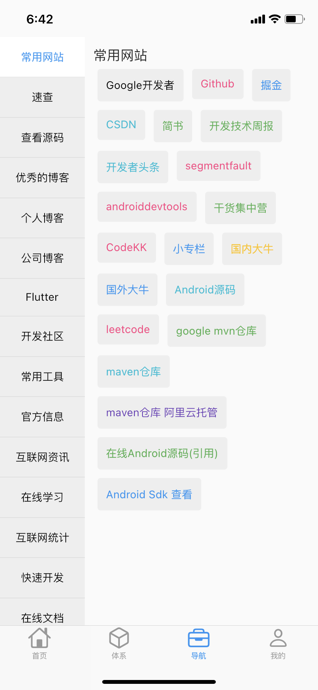
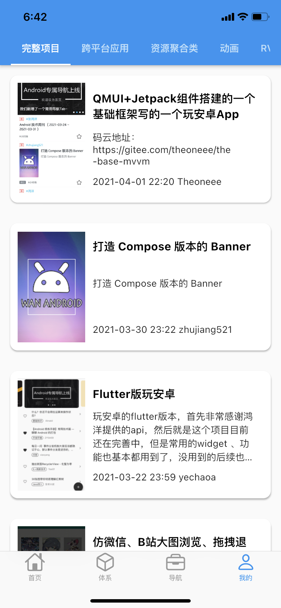
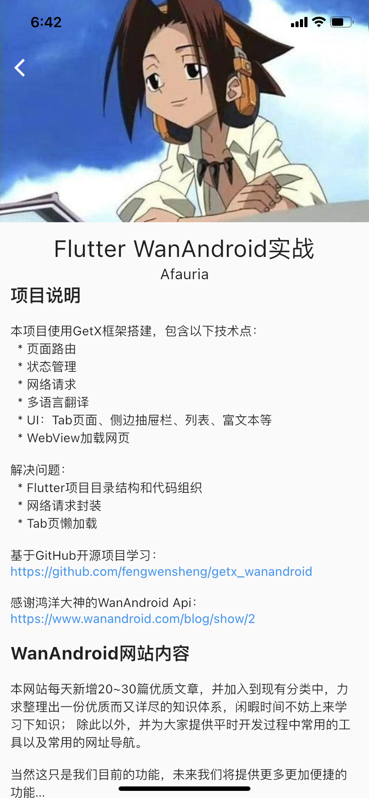

# Getx_WanAndroird

GetX sample with wanandroid

**基于[GitHub开源项目](https://github.com/fengwensheng/getx_wanandroid)学习**

**感谢鸿洋大神的[WanAndroid Api](https://www.wanandroid.com/blog/show/2)**

主要用于学习GetX框架，FlutterUI等。补充了一些功能，重构了目录和网络请求部分。

可以作为Flutter入门的工程模版，免去自行搭建架构，只需要关心UI开发和业务逻辑。

# 效果图

  
  